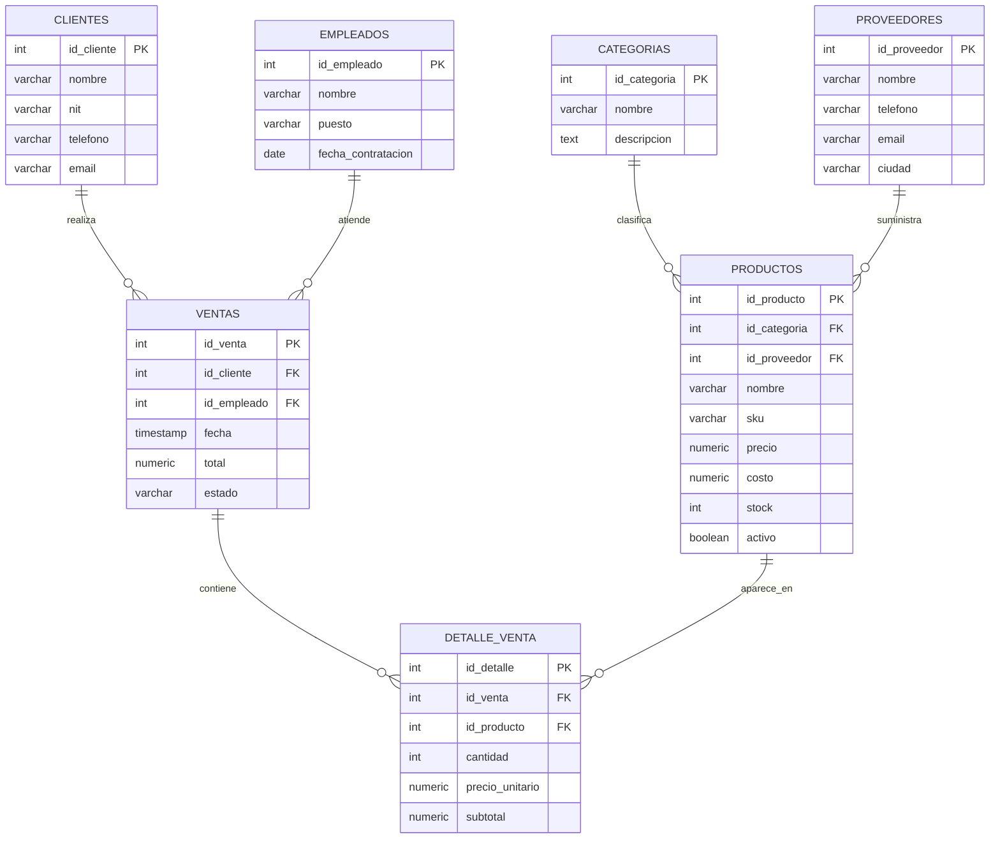

# Diagrama entidad-relacion

## Explicacion rapida de relaciones

- Una categoria puede tener muchos productos, pero cada producto pertenece a una categoria.
- Un proveedor puede suministrar muchos productos, pero cada producto tiene un proveedor principal.
- Un cliente puede realizar muchas ventas, pero cada venta pertenece a un cliente.
- Un empleado puede atender muchas ventas, pero cada venta es atendida por un empleado.
- Una venta puede tener varios productos mediante `detalle_venta`.
- Un producto puede aparecer en muchas ventas mediante `detalle_venta`.
