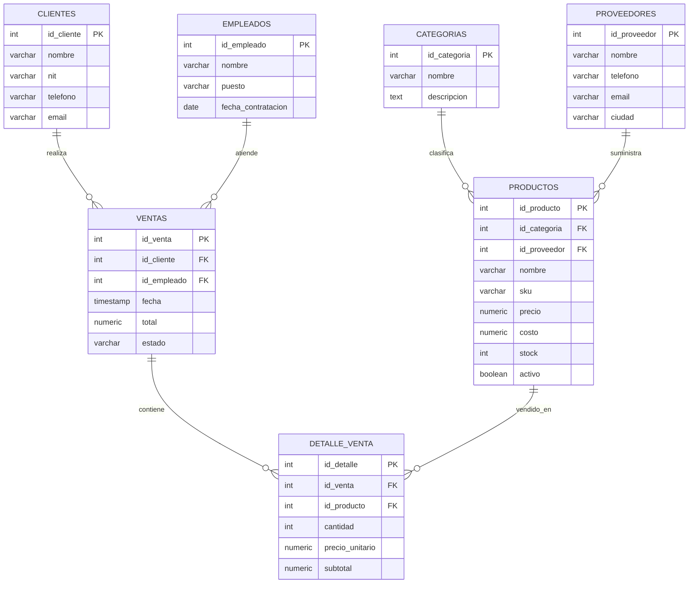

# Diseno de base de datos

## Diagrama ER

## Modelo relacional

- CATEGORIAS(id_categoria PK, nombre, descripcion)
- PROVEEDORES(id_proveedor PK, nombre, telefono, email, ciudad)
- CLIENTES(id_cliente PK, nombre, nit, telefono, email)
- EMPLEADOS(id_empleado PK, nombre, puesto, fecha_contratacion)
- PRODUCTOS(id_producto PK, id_categoria FK, id_proveedor FK, nombre, sku, precio, costo, stock, activo)
- VENTAS(id_venta PK, id_cliente FK, id_empleado FK, fecha, total, estado)
- DETALLE_VENTA(id_detalle PK, id_venta FK, id_producto FK, cantidad, precio_unitario, subtotal)

## Normalizacion hasta 3FN

### 1FN

Todas las tablas tienen atributos atomicos. Por ejemplo, una venta con varios productos no guarda una lista en una sola columna; usa `detalle_venta`, donde cada fila representa un producto vendido.

### 2FN

Las tablas usan llaves primarias simples y cada atributo no llave depende de la llave completa. En `detalle_venta`, la cantidad, el precio unitario y el subtotal pertenecen al detalle especifico identificado por `id_detalle`.

### 3FN

No se guardan dependencias transitivas innecesarias. El nombre de la categoria no se repite en `productos`; se consulta por la relacion con `categorias`. El nombre del cliente y empleado tampoco se repite en `ventas`, porque se obtiene mediante sus llaves foraneas.

## Dependencias funcionales principales

- id_categoria -> nombre, descripcion
- id_proveedor -> nombre, telefono, email, ciudad
- id_cliente -> nombre, nit, telefono, email
- id_empleado -> nombre, puesto, fecha_contratacion
- id_producto -> id_categoria, id_proveedor, nombre, sku, precio, costo, stock, activo
- id_venta -> id_cliente, id_empleado, fecha, total, estado
- id_detalle -> id_venta, id_producto, cantidad, precio_unitario, subtotal

## Indices justificados

- `idx_productos_nombre`: acelera busquedas y ordenamiento por producto.
- `idx_ventas_fecha`: acelera reportes ordenados o filtrados por fecha.
- `idx_detalle_producto`: acelera reportes de productos vendidos.

## SQL cubierto en la aplicacion

- `JOIN`: listado de productos y resumen de ventas.
- `GROUP BY` y `HAVING`: productos mas vendidos.
- Subquery con `IN`: clientes frecuentes.
- Subquery con `NOT EXISTS`: productos sin ventas.
- `CTE`: stock critico con promedio de inventario.
- `VIEW`: `vw_resumen_ventas`.
- Transaccion explicita: endpoint `POST /api/ventas`.
